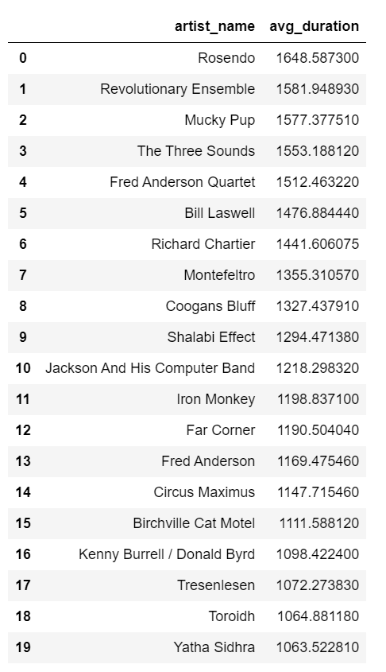

# Individual Project 3
The purpose of this project is to build upon the Databricks data pipeline that was constructed in mini-project 11. This repository contains multiple Databricks notebooks that perform ETL operations, as well as querying and visualizing the transformed data. In the process, I also conduct a data validation step to ensure that the data was successfully transformed and queried. Spark SQL was used to effectively transform the data and prepare it for analysis. The dataset used in this project contains various features of contemporary music songs, and is already included in the Databricks workspace as a sample dataset. Below I will overview the ETL and data analysis process.

1. `extract.ipynb` loads raw data into a table to make it available for later processing steps.
2. `transform_load.ipynb` transforms the original data into the appropriate column structure for analysis. Delta Lake is utilized for data storage.
3. `query_viz.ipynb` performs several query transformations on the prepared data using Spark SQL. A data validation check is also done to ensure the query was successful. An appropriate visualization of the data is also presented, and has been reproduced below along with the corresponding transformed data used to generate it.

The repository also contains a file called `trigger.py`. As the name suggests, this file serves as an automated trigger to initiate the Databricks pipeline and perform the data analysis/visualization remotely. To execute this within Github codespaces, simply run the command `python trigger.py` in the terminal to initiate the pipeline. A successful trigger and run in Databricks will look like the following: 

## Video Demo
https://www.youtube.com/watch?v=F233fhYGqAY

## Databricks Cluster
https://adb-6252625679681838.18.azuredatabricks.net/browse?o=6252625679681838

